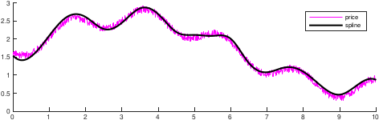

# 240032P3_ExParcial_2019-20

## Examen parcial Curs 2019-20 Q1. Problema 3

The Price of the shares of a company in the stock market for a 10 year
period are simulated using the Matlab instructions:
```matlab
t=0:0.01:10;
rng(1234); constant seed to simulate always the same points
price = 1.5+sin(0.5*t)-0.25*sin(3*t)+0.2*rand(1,length(t));
```
We want to approximate these values using a spline curve built taken only a
subset of these datsm in our case, taking every other 50 time ticks (see
__Hint 1__ below). To be able to compara the two approaches, we avaluate
the spline in all of the time tricks (see figure below).



(a) Compute the minimum and maximum values for all time values in
	the two curves

|        | minimun    | maximum    |
|--------|:-----------|:-----------|
| price  | 2.9257e-01 | 2.9105e-01 |
| spline | 4.6040e-01 | 2.8715e+00 |

   __Hint 1__ : We know that taken every other 40 time tricks, that is $t$ at
	components (1, 41, 81,...), the maximum value for the spline is 2.8467e+00.

(b) Compute the time for both curves to go below the value 1.3 for the
	first time:

| []()            |                |
|-----------------|----------------|	
| time for price  | 6.4600e+00     |
| time for spline | 6.5300e+00     |

   __Hint 2__: We know that taken every other 40 time ticks, te time value for
	the spline curve to reach the 1.3 is 4.4400e+00
